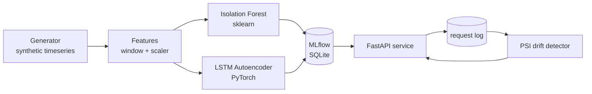

# Architecture

DQ Watchdog detects anomalies in data-quality metric timeseries by training **both** a classical model (Isolation Forest) and a sequence model (LSTM Autoencoder) on the same data, then comparing them per anomaly type. Both models register in MLflow, both load at service startup, both score behind one FastAPI endpoint.

## Pipeline

## Components

### `watchdog/generate.py` — Generator
Synthetic timeseries with realistic baselines + daily seasonality + Gaussian noise. Injects 4 anomaly types at labeled timestamps:

- `point_spike` — single-timestamp outlier
- `level_shift` — sustained step change
- `gradual_drift` — slow linear trend
- `missing_window` — zeros for N hours

Deterministic given a seed. `pandas.DataFrame` + labels JSON out.

### `watchdog/features.py` — FeatureBuilder
Windowing (default W=24) + `StandardScaler` fit on training data only. Two transforms from one source:
- `transform_flat()` → flat vectors for Isolation Forest
- `transform_sequence()` → 3D tensors for the Autoencoder

Persists as a single pickle alongside the model in MLflow.

### `watchdog/models/`
Both models implement the `AnomalyModel` Protocol: `fit(X_train, X_val)`, `score(X) → [0, 1]`, `save`, `load`.

- **`iforest.py`** — Isolation Forest with min-max calibration on val split.
- **`autoencoder.py`** — LSTM encoder-decoder, MSE reconstruction loss, percentile-calibrated scoring. CPU-friendly; auto-detects CUDA and falls back on OOM.

### `watchdog/train.py` — Orchestration
`train_both(df)` fits the FeatureBuilder, then trains each model under its own `mlflow.start_run()`. Each run logs params (hyperparameters + window size), metrics (training seconds), and artifacts (model + feature_builder.pkl).

### `watchdog/eval.py` — Eval metrics
- `label_windows(timestamps, anomalies, tolerance_hours)` — dilate anomaly windows by ±1h so near-misses count as TPs.
- `compute_metrics(y_true, scores, threshold)` — P, R, F1, AUC-PR.
- `per_type_metrics(...)` — same metrics but filtered by anomaly type. This is the differentiator.

### `watchdog/drift.py` — PSI
Population Stability Index with ε-substitution on empty bins. Three-band classifier: stable / monitor / drift. Operates on the **score distribution**, not the input features — we care about output drift, not input drift.

### `watchdog/service.py` — FastAPI service
Three endpoints:
- `POST /score` — accepts a window of metrics, returns both models' scores + an anomaly verdict.
- `GET /healthz` — health check.
- `GET /admin/drift` — current PSI report on each model's recent score distribution vs. the baseline logged at training time.

Every `/score` request is logged to SQLite (`request_log.db`); recent rows feed the drift endpoint.

### `watchdog/cli.py` — Typer CLI
Five commands: `generate`, `train`, `eval`, `serve`, `drift`.

## Key design choices

### Why two models?
For ML Engineer roles, the *comparison* is the signal. Anyone can train one model; the muscle interviewers test is "can you pick the right tool and justify it?" The Isolation Forest handles point spikes and missing windows beautifully and trains in <1s. The autoencoder is more expensive but sees sequence context the IF misses — especially gradual drift.

### Why a shared FeatureBuilder?
Training-serving skew is the most common cause of production ML incidents. Persisting the exact StandardScaler used during training as an MLflow artifact (alongside each model) eliminates one entire class of bug.

### Why MLflow local SQLite (not remote)?
Zero infrastructure. `mlflow.set_tracking_uri("sqlite:///mlruns.db")` is all it takes — and `mlflow ui` works against the same file. Real teams use a remote server; the local pattern still demonstrates the idiom cleanly.

### Why PSI on the *score* distribution?
Drift on inputs is a leading indicator; drift on scores is a lagging indicator that's also a more direct measure of "does my model's behavior look different than it used to?" For v1 the score-level signal is more actionable.

### Why no real production deployment?
Docker is the v1 deployment unit. Hosting (k8s, ECS, etc.) is interesting infrastructure work but not what an ML eng portfolio is measured on. The container is enough to prove the artifact is shippable.

### Why no online retraining?
Drift detection without retraining is still useful — it tells operators when to investigate. Closing the loop with automated retraining is v2 territory; for now the project demonstrates "I know to detect drift" which is the harder thing to communicate.
