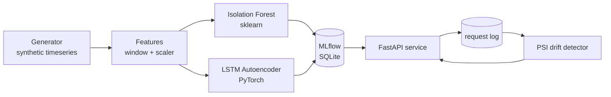

# DQ Watchdog Implementation Plan

> **For agentic workers:** REQUIRED SUB-SKILL: Use superpowers:subagent-driven-development (recommended) or superpowers:executing-plans to implement this plan task-by-task. Steps use checkbox (`- [ ]`) syntax for tracking.

**Goal:** Build a CLI + FastAPI service that generates synthetic data-quality timeseries with planted anomalies, trains both an Isolation Forest and an LSTM Autoencoder (tracked in MLflow), serves anomaly scoring, and detects production drift via PSI.

**Architecture:** Six components in a clean pipeline — Generator → Features → Models (IForest + Autoencoder) → Eval → Service → Drift Detector. Both models implement a shared Protocol, both register in MLflow, both load at service startup.

**Tech Stack:** Python 3.11+, scikit-learn (Isolation Forest), PyTorch (LSTM Autoencoder), MLflow (local SQLite), FastAPI + uvicorn, pandas + numpy + pyarrow, Pydantic v2, Typer, pytest, uv, ruff, hatchling, Docker.

---

## File Structure

```
dq-watchdog/
├── watchdog/
│   ├── __init__.py
│   ├── models_types.py          # Pydantic types: Metric, Window, ScoreResponse, etc.
│   ├── generate.py              # synthetic timeseries with planted anomalies
│   ├── features.py              # windowing + StandardScaler
│   ├── models/
│   │   ├── __init__.py
│   │   ├── base.py              # AnomalyModel Protocol
│   │   ├── iforest.py           # Isolation Forest
│   │   └── autoencoder.py       # LSTM Autoencoder (PyTorch)
│   ├── train.py                 # orchestration: train both, log to MLflow
│   ├── eval.py                  # precision/recall per anomaly type
│   ├── drift.py                 # PSI computation
│   ├── service.py               # FastAPI app
│   └── cli.py                   # Typer CLI
├── evals/
│   ├── fixtures/benchmark_v1/   # train.parquet, test.parquet, labels.json
│   ├── conftest.py
│   └── test_evals.py
├── tests/                       # unit tests, mirrors watchdog/
├── Dockerfile
├── pyproject.toml               # uv + ruff + hatchling
├── .env.example
├── .gitignore
├── README.md
└── docs/{ARCHITECTURE.md, EVALS.md, superpowers/}
```

**Note on naming:** `watchdog/models_types.py` (not `models.py`) because `watchdog/models/` is the ML models subpackage. Avoids the collision.

---

## Phase 0 — Project Setup

### Task 1: Initialize uv project

**Files:**
- Create: `pyproject.toml`, `.python-version`, `.env.example`, `watchdog/__init__.py`, `README.md` (stub)
- Modify: `.gitignore`

- [ ] **Step 1: Confirm uv installed**

Run: `uv --version`
Expected: prints `uv 0.x.x`.

- [ ] **Step 2: Create `pyproject.toml`**

```toml
[project]
name = "dq-watchdog"
version = "0.1.0"
description = "ML anomaly detector for data quality timeseries"
readme = "README.md"
requires-python = ">=3.11"
dependencies = [
    "scikit-learn>=1.5.0",
    "torch>=2.4.0",
    "mlflow>=2.17.0",
    "fastapi>=0.115.0",
    "uvicorn[standard]>=0.32.0",
    "pandas>=2.2.0",
    "numpy>=1.26.0",
    "pyarrow>=17.0.0",
    "pydantic>=2.9.0",
    "typer>=0.13.0",
    "python-dotenv>=1.0.0",
]

[project.scripts]
watchdog = "watchdog.cli:app"

[build-system]
requires = ["hatchling"]
build-backend = "hatchling.build"

[tool.hatch.build.targets.wheel]
packages = ["watchdog"]

[dependency-groups]
dev = [
    "pytest>=8.3.0",
    "pytest-cov>=6.0.0",
    "httpx>=0.27.0",
    "ruff>=0.7.0",
]

[tool.ruff]
line-length = 100
target-version = "py311"

[tool.ruff.lint]
select = ["E", "F", "I", "B", "UP", "SIM"]

[tool.pytest.ini_options]
testpaths = ["tests", "evals"]
filterwarnings = [
    "ignore::DeprecationWarning",
    "ignore::UserWarning:torch.*",
]
```

- [ ] **Step 3: Create `.python-version`**

```
3.11
```

- [ ] **Step 4: Create `.env.example`**

```
# Optional — defaults to ./mlruns.db
MLFLOW_TRACKING_URI=sqlite:///mlruns.db
# Set to 1 to run the slow eval harness
WATCHDOG_RUN_EVALS=
```

- [ ] **Step 5: Append to `.gitignore`**

```
.venv/
__pycache__/
*.pyc
.pytest_cache/
.ruff_cache/
.env
mlruns.db
mlruns/
mlartifacts/
request_log.db
data/
models/
*.parquet
!evals/fixtures/**/*.parquet
```

- [ ] **Step 6: Create `watchdog/__init__.py`**

```bash
mkdir -p watchdog
touch watchdog/__init__.py
```

- [ ] **Step 7: Create `README.md` stub**

```markdown
# DQ Watchdog

ML anomaly detector for data quality metrics. Trains both an Isolation Forest and an LSTM Autoencoder, serves both behind one FastAPI endpoint, detects drift via PSI.

(Full README written in Task 15.)
```

- [ ] **Step 8: Sync dependencies (this will take a while — PyTorch is large)**

Run: `uv sync`
Expected: creates `.venv` and `uv.lock`, installs ~100 packages. May take 2-5 minutes due to PyTorch.

- [ ] **Step 9: Verify Torch + sklearn + MLflow import**

Run: `uv run python -c "import torch, sklearn, mlflow, fastapi; print(torch.__version__, sklearn.__version__, mlflow.__version__)"`
Expected: prints three version strings without error.

- [ ] **Step 10: Commit**

```bash
git add pyproject.toml .python-version .env.example .gitignore watchdog/__init__.py README.md uv.lock
git -c user.name="Mona Alkhatib" -c user.email="muna.alkhateeb@gmail.com" commit -m "chore: initialize uv project with ML stack (torch, sklearn, mlflow, fastapi)"
```

---

## Phase 1 — Pydantic Types

### Task 2: Define core types + AnomalyModel protocol

**Files:**
- Create: `watchdog/models_types.py`
- Create: `watchdog/models/__init__.py`
- Create: `watchdog/models/base.py`
- Create: `tests/__init__.py`
- Create: `tests/test_models_types.py`

- [ ] **Step 1: Write the failing test `tests/test_models_types.py`**

```python
from datetime import datetime

import pytest
from pydantic import ValidationError

from watchdog.models_types import (
    AnomalyType,
    Metric,
    MetricPoint,
    ScoreRequest,
    ScoreResponse,
)


def test_anomaly_type_values():
    assert {t.value for t in AnomalyType} == {
        "point_spike", "level_shift", "gradual_drift", "missing_window"
    }


def test_metric_values():
    assert {m.value for m in Metric} == {
        "row_count", "null_rate", "freshness_lag_seconds", "schema_hash_changes", "duplicate_rate"
    }


def test_metric_point_basic():
    pt = MetricPoint(
        timestamp=datetime(2025, 1, 1, 0, 0, 0),
        row_count=100,
        null_rate=0.01,
        freshness_lag_seconds=120,
        schema_hash_changes=0,
        duplicate_rate=0.001,
    )
    assert pt.row_count == 100


def test_metric_point_rejects_negative_row_count():
    with pytest.raises(ValidationError):
        MetricPoint(
            timestamp=datetime(2025, 1, 1),
            row_count=-1,
            null_rate=0.01,
            freshness_lag_seconds=120,
            schema_hash_changes=0,
            duplicate_rate=0.001,
        )


def test_metric_point_rejects_null_rate_outside_unit_interval():
    with pytest.raises(ValidationError):
        MetricPoint(
            timestamp=datetime(2025, 1, 1),
            row_count=100,
            null_rate=1.5,
            freshness_lag_seconds=120,
            schema_hash_changes=0,
            duplicate_rate=0.001,
        )


def test_score_request_window_must_be_non_empty():
    with pytest.raises(ValidationError):
        ScoreRequest(window=[])


def test_score_response_basic():
    r = ScoreResponse(
        iforest_score=0.6,
        autoencoder_score=0.8,
        is_anomaly=True,
        model_versions={"iforest": "run_abc", "autoencoder": "run_xyz"},
    )
    assert r.is_anomaly is True
```

- [ ] **Step 2: Run, verify failure**

Run: `uv run pytest tests/test_models_types.py -v`
Expected: FAIL — module not found.

- [ ] **Step 3: Create `tests/__init__.py`**

```bash
touch tests/__init__.py
```

- [ ] **Step 4: Implement `watchdog/models_types.py`**

```python
"""Pydantic types used across the pipeline."""
from __future__ import annotations

from datetime import datetime
from enum import Enum
from typing import Any

from pydantic import BaseModel, Field


class Metric(str, Enum):
    ROW_COUNT = "row_count"
    NULL_RATE = "null_rate"
    FRESHNESS_LAG_SECONDS = "freshness_lag_seconds"
    SCHEMA_HASH_CHANGES = "schema_hash_changes"
    DUPLICATE_RATE = "duplicate_rate"


class AnomalyType(str, Enum):
    POINT_SPIKE = "point_spike"
    LEVEL_SHIFT = "level_shift"
    GRADUAL_DRIFT = "gradual_drift"
    MISSING_WINDOW = "missing_window"


class MetricPoint(BaseModel):
    timestamp: datetime
    row_count: int = Field(ge=0)
    null_rate: float = Field(ge=0.0, le=1.0)
    freshness_lag_seconds: int = Field(ge=0)
    schema_hash_changes: int = Field(ge=0)
    duplicate_rate: float = Field(ge=0.0, le=1.0)


class PlantedAnomaly(BaseModel):
    timestamp: datetime
    metric: Metric
    type: AnomalyType
    duration_hours: int = 1


class ScoreRequest(BaseModel):
    window: list[list[float]] = Field(min_length=1)
    metadata: dict[str, Any] = Field(default_factory=dict)


class ScoreResponse(BaseModel):
    iforest_score: float
    autoencoder_score: float
    is_anomaly: bool
    model_versions: dict[str, str]
```

- [ ] **Step 5: Run, verify pass**

Run: `uv run pytest tests/test_models_types.py -v`
Expected: 7 passed.

- [ ] **Step 6: Create `watchdog/models/__init__.py` (empty)**

```bash
mkdir -p watchdog/models
touch watchdog/models/__init__.py
```

- [ ] **Step 7: Implement `watchdog/models/base.py`**

```python
"""Shared Protocol for anomaly models.

Both Isolation Forest and LSTM Autoencoder implement this interface so
the rest of the pipeline (training, eval, service) is model-agnostic.
"""
from __future__ import annotations

from pathlib import Path
from typing import Protocol

import numpy as np


class AnomalyModel(Protocol):
    name: str

    def fit(self, X_train: np.ndarray, X_val: np.ndarray) -> None: ...

    def score(self, X: np.ndarray) -> np.ndarray:
        """Return anomaly scores in [0, 1]. Higher = more anomalous."""
        ...

    def save(self, path: Path) -> None: ...

    @classmethod
    def load(cls, path: Path) -> AnomalyModel: ...
```

- [ ] **Step 8: Commit**

```bash
git add watchdog/models_types.py watchdog/models tests/__init__.py tests/test_models_types.py
git -c user.name="Mona Alkhatib" -c user.email="muna.alkhateeb@gmail.com" commit -m "feat: add pydantic types and AnomalyModel protocol"
```

---

## Phase 2 — Synthetic Generator

### Task 3: Build synthetic timeseries generator

**Files:**
- Create: `watchdog/generate.py`
- Create: `tests/test_generate.py`

- [ ] **Step 1: Write the failing test `tests/test_generate.py`**

```python
from datetime import datetime, timedelta

import pandas as pd

from watchdog.generate import generate_timeseries
from watchdog.models_types import AnomalyType, Metric


def test_generate_produces_expected_row_count():
    df, _ = generate_timeseries(seed=42, num_days=2, hours_per_day=24, anomalies=[])
    assert len(df) == 48


def test_generate_includes_all_five_metrics():
    df, _ = generate_timeseries(seed=42, num_days=1, anomalies=[])
    assert {col for col in df.columns} >= {m.value for m in Metric} | {"timestamp"}


def test_generate_is_deterministic_given_seed():
    df1, _ = generate_timeseries(seed=7, num_days=2, anomalies=[])
    df2, _ = generate_timeseries(seed=7, num_days=2, anomalies=[])
    assert df1.equals(df2)


def test_generate_baselines_in_expected_ranges():
    df, _ = generate_timeseries(seed=42, num_days=5, anomalies=[])
    assert df["row_count"].min() > 0
    assert (df["null_rate"] >= 0).all() and (df["null_rate"] <= 1).all()
    assert (df["duplicate_rate"] >= 0).all() and (df["duplicate_rate"] <= 1).all()


def test_generate_injects_point_spike_at_labeled_timestamp():
    spike_at = datetime(2025, 1, 2, 12, 0, 0)
    df, labels = generate_timeseries(
        seed=42,
        num_days=5,
        anomalies=[
            {"timestamp": spike_at, "metric": "null_rate", "type": "point_spike"}
        ],
    )
    row = df[df["timestamp"] == spike_at].iloc[0]
    # spike should push null_rate noticeably above the baseline (≤ 0.05 typically).
    assert row["null_rate"] > 0.3
    assert any(lbl["type"] == "point_spike" for lbl in labels)


def test_generate_injects_level_shift_persists_for_duration():
    shift_at = datetime(2025, 1, 2, 0, 0, 0)
    df, _ = generate_timeseries(
        seed=42,
        num_days=5,
        anomalies=[
            {
                "timestamp": shift_at,
                "metric": "row_count",
                "type": "level_shift",
                "duration_hours": 6,
            }
        ],
    )
    # Compare the mean during the shift window vs before.
    pre = df[df["timestamp"] < shift_at]["row_count"].mean()
    during = df[
        (df["timestamp"] >= shift_at)
        & (df["timestamp"] < shift_at + timedelta(hours=6))
    ]["row_count"].mean()
    assert during > pre * 1.3 or during < pre * 0.7  # at least ~30% deviation


def test_generate_missing_window_zeroes_metric():
    miss_at = datetime(2025, 1, 2, 0, 0, 0)
    df, _ = generate_timeseries(
        seed=42,
        num_days=5,
        anomalies=[
            {
                "timestamp": miss_at,
                "metric": "row_count",
                "type": "missing_window",
                "duration_hours": 3,
            }
        ],
    )
    window = df[
        (df["timestamp"] >= miss_at)
        & (df["timestamp"] < miss_at + timedelta(hours=3))
    ]
    assert (window["row_count"] == 0).all()
```

- [ ] **Step 2: Run, verify failure**

Run: `uv run pytest tests/test_generate.py -v`
Expected: FAIL — module not found.

- [ ] **Step 3: Implement `watchdog/generate.py`**

```python
"""Synthetic timeseries generator for data quality metrics.

Emits 5 metrics per hour with realistic baselines + daily seasonality
+ Gaussian noise. Optionally injects anomalies at specific timestamps.

Deterministic given a seed.
"""
from __future__ import annotations

from datetime import datetime, timedelta
from typing import Any

import numpy as np
import pandas as pd

START = datetime(2025, 1, 1, 0, 0, 0)

BASELINES = {
    "row_count": {"mean": 50_000, "amplitude": 15_000, "noise_sd": 2_000},
    "null_rate": {"mean": 0.02, "amplitude": 0.005, "noise_sd": 0.003},
    "freshness_lag_seconds": {"mean": 600, "amplitude": 300, "noise_sd": 60},
    "schema_hash_changes": {"mean": 0, "amplitude": 0, "noise_sd": 0},
    "duplicate_rate": {"mean": 0.002, "amplitude": 0.0005, "noise_sd": 0.0003},
}


def _baseline_series(rng: np.random.Generator, n: int, params: dict) -> np.ndarray:
    t = np.arange(n)
    seasonal = params["amplitude"] * np.sin(2 * np.pi * t / 24)
    noise = rng.normal(0, params["noise_sd"], size=n)
    return params["mean"] + seasonal + noise


def _clip(values: np.ndarray, lo: float, hi: float) -> np.ndarray:
    return np.clip(values, lo, hi)


def _apply_anomaly(
    df: pd.DataFrame,
    rng: np.random.Generator,
    timestamp: datetime,
    metric: str,
    anomaly_type: str,
    duration_hours: int,
) -> None:
    idx = df.index[df["timestamp"] >= timestamp]
    if len(idx) == 0:
        return
    start = idx[0]
    end = min(start + duration_hours, len(df))

    if anomaly_type == "point_spike":
        baseline = df.at[start, metric]
        magnitude = 10 if metric != "null_rate" else 0.5
        df.at[start, metric] = baseline * magnitude if metric != "null_rate" else magnitude
    elif anomaly_type == "level_shift":
        scale = 1.6 if rng.random() < 0.5 else 0.4
        df.loc[start : end - 1, metric] = df.loc[start : end - 1, metric] * scale
    elif anomaly_type == "gradual_drift":
        # Linear trend that grows from 1.0 to 2.0 over the window.
        steps = end - start
        trend = np.linspace(1.0, 2.0, steps)
        df.loc[start : end - 1, metric] = df.loc[start : end - 1, metric] * trend
    elif anomaly_type == "missing_window":
        df.loc[start : end - 1, metric] = 0


def generate_timeseries(
    *,
    seed: int,
    num_days: int = 30,
    hours_per_day: int = 24,
    anomalies: list[dict[str, Any]] | None = None,
) -> tuple[pd.DataFrame, list[dict[str, Any]]]:
    rng = np.random.default_rng(seed)
    n = num_days * hours_per_day
    timestamps = [START + timedelta(hours=i) for i in range(n)]
    df = pd.DataFrame({"timestamp": timestamps})

    for metric, params in BASELINES.items():
        series = _baseline_series(rng, n, params)
        if metric in {"null_rate", "duplicate_rate"}:
            series = _clip(series, 0.0, 1.0)
        elif metric == "row_count":
            series = _clip(series, 0, None).astype(int)
        elif metric == "freshness_lag_seconds":
            series = _clip(series, 0, None).astype(int)
        elif metric == "schema_hash_changes":
            series = np.zeros(n, dtype=int)
        df[metric] = series

    labels: list[dict[str, Any]] = []
    for a in anomalies or []:
        _apply_anomaly(
            df,
            rng,
            timestamp=a["timestamp"],
            metric=a["metric"],
            anomaly_type=a["type"],
            duration_hours=int(a.get("duration_hours", 1)),
        )
        labels.append({
            "timestamp": a["timestamp"].isoformat() if isinstance(a["timestamp"], datetime) else a["timestamp"],
            "metric": a["metric"],
            "type": a["type"],
            "duration_hours": int(a.get("duration_hours", 1)),
        })

    return df, labels
```

- [ ] **Step 4: Run, verify pass**

Run: `uv run pytest tests/test_generate.py -v`
Expected: 7 passed.

- [ ] **Step 5: Commit**

```bash
git add watchdog/generate.py tests/test_generate.py
git -c user.name="Mona Alkhatib" -c user.email="muna.alkhateeb@gmail.com" commit -m "feat: add synthetic timeseries generator with 4 anomaly types"
```

---

## Phase 3 — Features

### Task 4: Build windowing + scaler

**Files:**
- Create: `watchdog/features.py`
- Create: `tests/test_features.py`

- [ ] **Step 1: Write the failing test `tests/test_features.py`**

```python
import numpy as np
import pandas as pd

from watchdog.features import FeatureBuilder


def _df(n=48):
    return pd.DataFrame({
        "row_count": np.arange(n) * 10.0,
        "null_rate": np.linspace(0, 0.1, n),
        "freshness_lag_seconds": np.arange(n) * 1.0,
        "schema_hash_changes": np.zeros(n),
        "duplicate_rate": np.linspace(0, 0.01, n),
    })


def test_windowing_produces_expected_shape():
    fb = FeatureBuilder(window_size=24)
    fb.fit(_df(48))
    sequences = fb.transform_sequence(_df(48))
    # n - W + 1 = 48 - 24 + 1 = 25 windows
    assert sequences.shape == (25, 24, 5)


def test_flat_transform_flattens_window():
    fb = FeatureBuilder(window_size=24)
    fb.fit(_df(48))
    flat = fb.transform_flat(_df(48))
    assert flat.shape == (25, 24 * 5)


def test_scaler_fitted_on_train_only():
    fb = FeatureBuilder(window_size=12)
    train = _df(48)
    test = _df(48) * 5  # different scale
    fb.fit(train)
    train_seq = fb.transform_sequence(train)
    test_seq = fb.transform_sequence(test)
    # Train should be roughly centered; test scaled with same params should be >> 1 in magnitude.
    assert abs(train_seq.mean()) < 1.0
    assert abs(test_seq.mean()) > 1.0


def test_save_and_load_round_trip(tmp_path):
    fb = FeatureBuilder(window_size=12)
    fb.fit(_df(48))
    p = tmp_path / "fb.pkl"
    fb.save(p)
    loaded = FeatureBuilder.load(p)
    a = fb.transform_flat(_df(48))
    b = loaded.transform_flat(_df(48))
    assert np.allclose(a, b)
```

- [ ] **Step 2: Run, verify failure**

Run: `uv run pytest tests/test_features.py -v`
Expected: FAIL.

- [ ] **Step 3: Implement `watchdog/features.py`**

```python
"""Windowing + normalization for data quality metric timeseries.

FeatureBuilder is fit on training data only. It exposes two transforms:
- transform_flat: (n - W + 1, W * F) for classical models (Isolation Forest)
- transform_sequence: (n - W + 1, W, F) for sequence models (LSTM)

Persists to a single pickle file alongside the model in MLflow.
"""
from __future__ import annotations

import pickle
from pathlib import Path

import numpy as np
import pandas as pd
from sklearn.preprocessing import StandardScaler

METRIC_COLUMNS = [
    "row_count",
    "null_rate",
    "freshness_lag_seconds",
    "schema_hash_changes",
    "duplicate_rate",
]


class FeatureBuilder:
    def __init__(self, window_size: int = 24) -> None:
        self.window_size = window_size
        self.scaler = StandardScaler()
        self._fitted = False

    def fit(self, df: pd.DataFrame) -> None:
        self.scaler.fit(df[METRIC_COLUMNS].to_numpy(dtype=float))
        self._fitted = True

    def _scaled_values(self, df: pd.DataFrame) -> np.ndarray:
        if not self._fitted:
            raise RuntimeError("FeatureBuilder must be fit before transform.")
        return self.scaler.transform(df[METRIC_COLUMNS].to_numpy(dtype=float))

    def transform_sequence(self, df: pd.DataFrame) -> np.ndarray:
        scaled = self._scaled_values(df)
        n = len(scaled)
        if n < self.window_size:
            raise ValueError(f"need at least {self.window_size} rows, got {n}")
        windows = np.stack(
            [scaled[i : i + self.window_size] for i in range(n - self.window_size + 1)]
        )
        return windows

    def transform_flat(self, df: pd.DataFrame) -> np.ndarray:
        seq = self.transform_sequence(df)
        return seq.reshape(seq.shape[0], -1)

    def save(self, path: Path) -> None:
        Path(path).parent.mkdir(parents=True, exist_ok=True)
        with Path(path).open("wb") as f:
            pickle.dump(self, f)

    @classmethod
    def load(cls, path: Path) -> "FeatureBuilder":
        with Path(path).open("rb") as f:
            return pickle.load(f)
```

- [ ] **Step 4: Run, verify pass**

Run: `uv run pytest tests/test_features.py -v`
Expected: 4 passed.

- [ ] **Step 5: Commit**

```bash
git add watchdog/features.py tests/test_features.py
git -c user.name="Mona Alkhatib" -c user.email="muna.alkhateeb@gmail.com" commit -m "feat: add FeatureBuilder with windowing and StandardScaler"
```

---

## Phase 4 — Models

### Task 5: Implement Isolation Forest

**Files:**
- Create: `watchdog/models/iforest.py`
- Create: `tests/test_iforest.py`

- [ ] **Step 1: Write the failing test `tests/test_iforest.py`**

```python
import numpy as np

from watchdog.models.iforest import IForestModel


def _rand_X(rows=50, dim=120, seed=0):
    rng = np.random.default_rng(seed)
    return rng.standard_normal((rows, dim))


def test_iforest_fit_score_returns_array_in_unit_interval():
    m = IForestModel(n_estimators=50, random_state=0)
    X_train = _rand_X(50)
    X_val = _rand_X(20)
    m.fit(X_train, X_val)
    scores = m.score(_rand_X(10))
    assert scores.shape == (10,)
    assert (scores >= 0).all() and (scores <= 1).all()


def test_iforest_is_deterministic_with_seed():
    a = IForestModel(n_estimators=50, random_state=42)
    b = IForestModel(n_estimators=50, random_state=42)
    X_train, X_val = _rand_X(50), _rand_X(20)
    a.fit(X_train, X_val)
    b.fit(X_train, X_val)
    X_test = _rand_X(10, seed=99)
    assert np.allclose(a.score(X_test), b.score(X_test))


def test_iforest_save_and_load(tmp_path):
    m = IForestModel(n_estimators=20, random_state=0)
    m.fit(_rand_X(50), _rand_X(20))
    p = tmp_path / "iforest.pkl"
    m.save(p)
    loaded = IForestModel.load(p)
    X_test = _rand_X(5, seed=7)
    assert np.allclose(m.score(X_test), loaded.score(X_test))


def test_iforest_name():
    assert IForestModel().name == "iforest"
```

- [ ] **Step 2: Run, verify failure**

Run: `uv run pytest tests/test_iforest.py -v`
Expected: FAIL.

- [ ] **Step 3: Implement `watchdog/models/iforest.py`**

```python
"""Isolation Forest anomaly model.

decision_function returns a value where higher = more normal. We
negate and min-max scale on the validation split so output scores
live in [0, 1] with 1 = most anomalous.
"""
from __future__ import annotations

import pickle
from pathlib import Path

import numpy as np
from sklearn.ensemble import IsolationForest


class IForestModel:
    name = "iforest"

    def __init__(self, n_estimators: int = 200, random_state: int = 0) -> None:
        self.n_estimators = n_estimators
        self.random_state = random_state
        self._model: IsolationForest | None = None
        self._calibration_min: float = 0.0
        self._calibration_max: float = 1.0

    def fit(self, X_train: np.ndarray, X_val: np.ndarray) -> None:
        self._model = IsolationForest(
            n_estimators=self.n_estimators,
            contamination="auto",
            random_state=self.random_state,
        )
        self._model.fit(X_train)
        raw_val = -self._model.decision_function(X_val)
        self._calibration_min = float(np.min(raw_val))
        self._calibration_max = float(np.max(raw_val))

    def score(self, X: np.ndarray) -> np.ndarray:
        if self._model is None:
            raise RuntimeError("Model not fit")
        raw = -self._model.decision_function(X)
        if self._calibration_max == self._calibration_min:
            return np.zeros_like(raw)
        scaled = (raw - self._calibration_min) / (
            self._calibration_max - self._calibration_min
        )
        return np.clip(scaled, 0.0, 1.0)

    def save(self, path: Path) -> None:
        Path(path).parent.mkdir(parents=True, exist_ok=True)
        with Path(path).open("wb") as f:
            pickle.dump(self, f)

    @classmethod
    def load(cls, path: Path) -> "IForestModel":
        with Path(path).open("rb") as f:
            return pickle.load(f)
```

- [ ] **Step 4: Run, verify pass**

Run: `uv run pytest tests/test_iforest.py -v`
Expected: 4 passed.

- [ ] **Step 5: Commit**

```bash
git add watchdog/models/iforest.py tests/test_iforest.py
git -c user.name="Mona Alkhatib" -c user.email="muna.alkhateeb@gmail.com" commit -m "feat: add Isolation Forest model with calibrated [0,1] scores"
```

---

### Task 6: Implement LSTM Autoencoder (PyTorch)

**Files:**
- Create: `watchdog/models/autoencoder.py`
- Create: `tests/test_autoencoder.py`

- [ ] **Step 1: Write the failing test `tests/test_autoencoder.py`**

```python
import numpy as np

from watchdog.models.autoencoder import AutoencoderModel


def _rand_seq(rows=30, window=12, features=5, seed=0):
    rng = np.random.default_rng(seed)
    return rng.standard_normal((rows, window, features)).astype(np.float32)


def test_autoencoder_fit_score_returns_unit_interval():
    m = AutoencoderModel(hidden_dim=8, epochs=2, batch_size=8, random_state=0)
    X_train = _rand_seq(40)
    X_val = _rand_seq(10, seed=1)
    m.fit(X_train, X_val)
    scores = m.score(_rand_seq(5, seed=2))
    assert scores.shape == (5,)
    assert (scores >= 0).all() and (scores <= 1).all()


def test_autoencoder_save_and_load(tmp_path):
    m = AutoencoderModel(hidden_dim=4, epochs=2, batch_size=8, random_state=0)
    m.fit(_rand_seq(40), _rand_seq(10, seed=1))
    p = tmp_path / "ae.pt"
    m.save(p)
    loaded = AutoencoderModel.load(p)
    X_test = _rand_seq(3, seed=7)
    a = m.score(X_test)
    b = loaded.score(X_test)
    assert np.allclose(a, b, atol=1e-5)


def test_autoencoder_name():
    assert AutoencoderModel().name == "autoencoder"
```

- [ ] **Step 2: Run, verify failure**

Run: `uv run pytest tests/test_autoencoder.py -v`
Expected: FAIL.

- [ ] **Step 3: Implement `watchdog/models/autoencoder.py`**

```python
"""LSTM Autoencoder anomaly model.

Trains via reconstruction MSE on sequence windows. Anomaly score =
normalized reconstruction error, calibrated on a validation split.

CPU-friendly: hidden_dim=32 with batch_size=64 trains in seconds on
30 days of hourly data. Auto-detects CUDA, falls back to CPU on OOM.
"""
from __future__ import annotations

from pathlib import Path

import numpy as np
import torch
from torch import nn
from torch.utils.data import DataLoader, TensorDataset


class _AE(nn.Module):
    def __init__(self, n_features: int, hidden_dim: int) -> None:
        super().__init__()
        self.encoder = nn.LSTM(
            input_size=n_features, hidden_size=hidden_dim, batch_first=True
        )
        self.decoder = nn.LSTM(
            input_size=hidden_dim, hidden_size=hidden_dim, batch_first=True
        )
        self.output = nn.Linear(hidden_dim, n_features)

    def forward(self, x: torch.Tensor) -> torch.Tensor:
        _, (h, _) = self.encoder(x)
        # Repeat the final hidden state across the sequence length.
        seq_len = x.size(1)
        decoded_input = h[-1].unsqueeze(1).repeat(1, seq_len, 1)
        decoded, _ = self.decoder(decoded_input)
        return self.output(decoded)


def _pick_device() -> torch.device:
    if torch.cuda.is_available():
        try:
            torch.cuda.init()
            return torch.device("cuda")
        except RuntimeError:
            return torch.device("cpu")
    return torch.device("cpu")


class AutoencoderModel:
    name = "autoencoder"

    def __init__(
        self,
        hidden_dim: int = 32,
        epochs: int = 30,
        batch_size: int = 64,
        lr: float = 1e-3,
        random_state: int = 0,
    ) -> None:
        self.hidden_dim = hidden_dim
        self.epochs = epochs
        self.batch_size = batch_size
        self.lr = lr
        self.random_state = random_state
        self._net: _AE | None = None
        self._n_features: int = 0
        self._device = _pick_device()
        self._calibration_min: float = 0.0
        self._calibration_max: float = 1.0

    def _reconstruction_errors(self, X: np.ndarray) -> np.ndarray:
        assert self._net is not None
        self._net.eval()
        with torch.no_grad():
            x = torch.from_numpy(X.astype(np.float32)).to(self._device)
            recon = self._net(x)
            err = ((recon - x) ** 2).mean(dim=(1, 2))
        return err.cpu().numpy()

    def fit(self, X_train: np.ndarray, X_val: np.ndarray) -> None:
        torch.manual_seed(self.random_state)
        self._n_features = X_train.shape[-1]
        self._net = _AE(self._n_features, self.hidden_dim).to(self._device)
        optim = torch.optim.Adam(self._net.parameters(), lr=self.lr)
        loss_fn = nn.MSELoss()

        train_ds = TensorDataset(torch.from_numpy(X_train.astype(np.float32)))
        loader = DataLoader(train_ds, batch_size=self.batch_size, shuffle=True)

        self._net.train()
        for _ in range(self.epochs):
            for (batch,) in loader:
                batch = batch.to(self._device)
                optim.zero_grad()
                out = self._net(batch)
                loss = loss_fn(out, batch)
                loss.backward()
                optim.step()

        val_err = self._reconstruction_errors(X_val)
        self._calibration_min = float(np.min(val_err))
        self._calibration_max = float(np.max(val_err))

    def score(self, X: np.ndarray) -> np.ndarray:
        if self._net is None:
            raise RuntimeError("Model not fit")
        err = self._reconstruction_errors(X)
        if self._calibration_max == self._calibration_min:
            return np.zeros_like(err)
        scaled = (err - self._calibration_min) / (
            self._calibration_max - self._calibration_min
        )
        return np.clip(scaled, 0.0, 1.0)

    def save(self, path: Path) -> None:
        if self._net is None:
            raise RuntimeError("Model not fit")
        Path(path).parent.mkdir(parents=True, exist_ok=True)
        torch.save(
            {
                "state_dict": self._net.state_dict(),
                "n_features": self._n_features,
                "hidden_dim": self.hidden_dim,
                "epochs": self.epochs,
                "batch_size": self.batch_size,
                "lr": self.lr,
                "random_state": self.random_state,
                "calibration_min": self._calibration_min,
                "calibration_max": self._calibration_max,
            },
            path,
        )

    @classmethod
    def load(cls, path: Path) -> "AutoencoderModel":
        checkpoint = torch.load(path, weights_only=False, map_location="cpu")
        instance = cls(
            hidden_dim=checkpoint["hidden_dim"],
            epochs=checkpoint["epochs"],
            batch_size=checkpoint["batch_size"],
            lr=checkpoint["lr"],
            random_state=checkpoint["random_state"],
        )
        instance._n_features = checkpoint["n_features"]
        instance._device = torch.device("cpu")
        instance._net = _AE(instance._n_features, instance.hidden_dim).to(instance._device)
        instance._net.load_state_dict(checkpoint["state_dict"])
        instance._calibration_min = checkpoint["calibration_min"]
        instance._calibration_max = checkpoint["calibration_max"]
        return instance
```

- [ ] **Step 4: Run, verify pass**

Run: `uv run pytest tests/test_autoencoder.py -v`
Expected: 3 passed (may take 5-15 seconds due to training).

- [ ] **Step 5: Commit**

```bash
git add watchdog/models/autoencoder.py tests/test_autoencoder.py
git -c user.name="Mona Alkhatib" -c user.email="muna.alkhateeb@gmail.com" commit -m "feat: add LSTM autoencoder with calibrated reconstruction-error scoring"
```

---

## Phase 5 — Training Orchestration

### Task 7: Wire MLflow-tracked training

**Files:**
- Create: `watchdog/train.py`
- Create: `tests/test_train.py`

- [ ] **Step 1: Write the failing test `tests/test_train.py`**

```python
from datetime import datetime

import mlflow
import pandas as pd

from watchdog.generate import generate_timeseries
from watchdog.train import train_both


def test_train_both_logs_two_mlflow_runs(tmp_path, monkeypatch):
    tracking = f"sqlite:///{tmp_path / 'mlruns.db'}"
    monkeypatch.setenv("MLFLOW_TRACKING_URI", tracking)
    mlflow.set_tracking_uri(tracking)

    df, _ = generate_timeseries(seed=11, num_days=4)
    result = train_both(
        df=df,
        window_size=12,
        iforest_params={"n_estimators": 10},
        autoencoder_params={"hidden_dim": 4, "epochs": 2, "batch_size": 8},
        tracking_uri=tracking,
    )

    assert "iforest" in result and "autoencoder" in result
    assert result["iforest"]["run_id"]
    assert result["autoencoder"]["run_id"]

    client = mlflow.tracking.MlflowClient(tracking_uri=tracking)
    iforest_run = client.get_run(result["iforest"]["run_id"])
    assert iforest_run.data.params["model"] == "iforest"
    assert "training_seconds" in iforest_run.data.metrics
```

- [ ] **Step 2: Run, verify failure**

Run: `uv run pytest tests/test_train.py -v`
Expected: FAIL.

- [ ] **Step 3: Implement `watchdog/train.py`**

```python
"""Train both models and log to MLflow.

Each model gets its own MLflow run. Both runs log:
- params (hyperparameters)
- metrics (training time, calibration min/max)
- artifacts (model file + the shared FeatureBuilder)
"""
from __future__ import annotations

import tempfile
import time
from pathlib import Path
from typing import Any

import mlflow
import pandas as pd

from watchdog.features import FeatureBuilder
from watchdog.models.autoencoder import AutoencoderModel
from watchdog.models.iforest import IForestModel

EXPERIMENT_NAME = "dq-watchdog"


def _ensure_experiment() -> None:
    if mlflow.get_experiment_by_name(EXPERIMENT_NAME) is None:
        mlflow.create_experiment(EXPERIMENT_NAME)
    mlflow.set_experiment(EXPERIMENT_NAME)


def _train_one(
    model_name: str,
    model: Any,
    X_train: Any,
    X_val: Any,
    feature_builder: FeatureBuilder,
    params: dict[str, Any],
) -> dict[str, Any]:
    with mlflow.start_run(run_name=model_name) as run:
        mlflow.log_param("model", model_name)
        for k, v in params.items():
            mlflow.log_param(k, v)
        mlflow.log_param("window_size", feature_builder.window_size)

        t0 = time.perf_counter()
        model.fit(X_train, X_val)
        elapsed = time.perf_counter() - t0

        mlflow.log_metric("training_seconds", elapsed)

        with tempfile.TemporaryDirectory() as td:
            tdp = Path(td)
            model_path = tdp / f"{model_name}.pkl"
            scaler_path = tdp / "feature_builder.pkl"
            model.save(model_path)
            feature_builder.save(scaler_path)
            mlflow.log_artifact(str(model_path))
            mlflow.log_artifact(str(scaler_path))

        return {"run_id": run.info.run_id, "training_seconds": elapsed}


def train_both(
    *,
    df: pd.DataFrame,
    window_size: int = 24,
    iforest_params: dict[str, Any] | None = None,
    autoencoder_params: dict[str, Any] | None = None,
    tracking_uri: str | None = None,
    val_fraction: float = 0.2,
) -> dict[str, dict[str, Any]]:
    if tracking_uri:
        mlflow.set_tracking_uri(tracking_uri)
    _ensure_experiment()

    n = len(df)
    cut = int(n * (1 - val_fraction))
    train_df, val_df = df.iloc[:cut], df.iloc[cut:]

    fb = FeatureBuilder(window_size=window_size)
    fb.fit(train_df)
    X_train_seq = fb.transform_sequence(train_df)
    X_val_seq = fb.transform_sequence(val_df)
    X_train_flat = fb.transform_flat(train_df)
    X_val_flat = fb.transform_flat(val_df)

    iforest = IForestModel(**(iforest_params or {}))
    autoencoder = AutoencoderModel(**(autoencoder_params or {}))

    out: dict[str, dict[str, Any]] = {}
    out["iforest"] = _train_one(
        "iforest", iforest, X_train_flat, X_val_flat, fb, iforest_params or {}
    )
    out["autoencoder"] = _train_one(
        "autoencoder",
        autoencoder,
        X_train_seq,
        X_val_seq,
        fb,
        autoencoder_params or {},
    )
    return out
```

- [ ] **Step 4: Run, verify pass**

Run: `uv run pytest tests/test_train.py -v`
Expected: 1 passed (may take 10-20 seconds).

- [ ] **Step 5: Commit**

```bash
git add watchdog/train.py tests/test_train.py
git -c user.name="Mona Alkhatib" -c user.email="muna.alkhateeb@gmail.com" commit -m "feat: add MLflow-tracked training orchestration"
```

---

## Phase 6 — Eval (precision/recall per anomaly type)

### Task 8: Implement eval metrics

**Files:**
- Create: `watchdog/eval.py`
- Create: `tests/test_eval.py`

- [ ] **Step 1: Write the failing test `tests/test_eval.py`**

```python
import numpy as np
import pandas as pd

from watchdog.eval import compute_metrics, label_windows


def test_label_windows_marks_anomaly_windows():
    timestamps = pd.date_range("2025-01-01", periods=10, freq="h")
    anomalies = [
        {"timestamp": "2025-01-01T05:00:00", "type": "point_spike", "duration_hours": 1}
    ]
    labels = label_windows(timestamps, anomalies, tolerance_hours=1)
    # Anomaly at hour 5 with ±1 tolerance ⇒ hours 4, 5, 6 marked true.
    assert labels[4] and labels[5] and labels[6]
    assert not labels[0] and not labels[9]


def test_compute_metrics_basic_precision_recall():
    y_true = np.array([0, 0, 1, 1, 1, 0, 1])
    scores = np.array([0.1, 0.2, 0.9, 0.8, 0.7, 0.3, 0.6])
    metrics = compute_metrics(y_true=y_true, scores=scores, threshold=0.5)
    # TP = 4 (hours 2,3,4,6), FP = 0, FN = 0 → P = R = F1 = 1.0
    assert metrics["precision"] == 1.0
    assert metrics["recall"] == 1.0
    assert metrics["f1"] == 1.0
    assert metrics["auc_pr"] > 0.95


def test_compute_metrics_with_misses():
    y_true = np.array([0, 1, 1, 1, 0])
    scores = np.array([0.1, 0.2, 0.9, 0.4, 0.3])
    metrics = compute_metrics(y_true=y_true, scores=scores, threshold=0.5)
    # Only hour 2 is detected; 1 and 3 are misses → recall = 1/3
    assert abs(metrics["recall"] - (1 / 3)) < 1e-6
```

- [ ] **Step 2: Run, verify failure**

Run: `uv run pytest tests/test_eval.py -v`
Expected: FAIL.

- [ ] **Step 3: Implement `watchdog/eval.py`**

```python
"""Eval metrics: precision/recall/F1/AUC-PR per anomaly type.

Anomaly labels are dilated by a tolerance window so a near-miss in
time counts as a true positive (real on-call doesn't fire at the
exact second the spike happens).
"""
from __future__ import annotations

from datetime import datetime, timedelta
from typing import Any

import numpy as np
import pandas as pd
from sklearn.metrics import average_precision_score, precision_recall_fscore_support


def label_windows(
    timestamps: pd.DatetimeIndex | pd.Series,
    anomalies: list[dict[str, Any]],
    tolerance_hours: int = 1,
) -> np.ndarray:
    """Return a boolean array marking which timestamps fall inside any
    anomaly window (with ±tolerance)."""
    ts = pd.to_datetime(pd.Index(timestamps))
    labels = np.zeros(len(ts), dtype=bool)
    tol = timedelta(hours=tolerance_hours)
    for a in anomalies:
        start = pd.to_datetime(a["timestamp"])
        duration = timedelta(hours=int(a.get("duration_hours", 1)))
        window_start = start - tol
        window_end = start + duration + tol
        in_window = (ts >= window_start) & (ts < window_end)
        labels |= in_window.to_numpy()
    return labels


def compute_metrics(
    *,
    y_true: np.ndarray,
    scores: np.ndarray,
    threshold: float,
) -> dict[str, float]:
    y_pred = (scores >= threshold).astype(int)
    p, r, f1, _ = precision_recall_fscore_support(
        y_true.astype(int), y_pred, average="binary", zero_division=0
    )
    auc_pr = float(average_precision_score(y_true.astype(int), scores))
    return {
        "precision": float(p),
        "recall": float(r),
        "f1": float(f1),
        "auc_pr": auc_pr,
        "n_positives": int(y_true.sum()),
        "n_predicted": int(y_pred.sum()),
    }


def per_type_metrics(
    *,
    timestamps: pd.DatetimeIndex | pd.Series,
    scores: np.ndarray,
    anomalies: list[dict[str, Any]],
    threshold: float,
    tolerance_hours: int = 1,
) -> dict[str, dict[str, float]]:
    """Compute metrics for each anomaly type separately by filtering
    the labels to that type only."""
    by_type: dict[str, dict[str, float]] = {}
    types = {a["type"] for a in anomalies}
    for atype in sorted(types):
        type_anoms = [a for a in anomalies if a["type"] == atype]
        y_true = label_windows(timestamps, type_anoms, tolerance_hours)
        by_type[atype] = compute_metrics(y_true=y_true, scores=scores, threshold=threshold)
    return by_type
```

- [ ] **Step 4: Run, verify pass**

Run: `uv run pytest tests/test_eval.py -v`
Expected: 3 passed.

- [ ] **Step 5: Commit**

```bash
git add watchdog/eval.py tests/test_eval.py
git -c user.name="Mona Alkhatib" -c user.email="muna.alkhateeb@gmail.com" commit -m "feat: add per-anomaly-type precision/recall/F1/AUC-PR metrics"
```

---

## Phase 7 — Drift Detection

### Task 9: Implement PSI

**Files:**
- Create: `watchdog/drift.py`
- Create: `tests/test_drift.py`

- [ ] **Step 1: Write the failing test `tests/test_drift.py`**

```python
import numpy as np

from watchdog.drift import classify_psi, compute_psi


def test_psi_zero_for_identical_distributions():
    baseline = np.random.default_rng(0).beta(2, 5, size=1000)
    production = np.random.default_rng(0).beta(2, 5, size=1000)
    psi = compute_psi(baseline=baseline, production=production, n_bins=10)
    assert psi < 0.05  # essentially zero


def test_psi_significant_for_shifted_distributions():
    baseline = np.random.default_rng(0).beta(2, 5, size=1000)
    production = np.random.default_rng(1).beta(5, 2, size=1000)  # very different
    psi = compute_psi(baseline=baseline, production=production, n_bins=10)
    assert psi > 0.3


def test_classify_psi_thresholds():
    assert classify_psi(0.05) == "stable"
    assert classify_psi(0.15) == "monitor"
    assert classify_psi(0.30) == "drift"


def test_psi_handles_empty_bins_with_epsilon():
    # Production has all values in one bin; should not divide by zero.
    baseline = np.linspace(0, 1, 200)
    production = np.array([0.5] * 200)
    psi = compute_psi(baseline=baseline, production=production, n_bins=10)
    assert psi > 0  # finite, large
    assert np.isfinite(psi)
```

- [ ] **Step 2: Run, verify failure**

Run: `uv run pytest tests/test_drift.py -v`
Expected: FAIL.

- [ ] **Step 3: Implement `watchdog/drift.py`**

```python
"""Population Stability Index (PSI).

PSI = sum over bins of (p_prod - p_base) * ln(p_prod / p_base).

Thresholds:
  PSI < 0.1   → stable
  0.1 ≤ PSI < 0.2 → monitor
  PSI ≥ 0.2   → drift (warning)

Empty bins use ε-substitution (replace 0 with 1e-6) so the log is finite.
"""
from __future__ import annotations

from typing import Literal

import numpy as np

PSI_MONITOR = 0.1
PSI_DRIFT = 0.2
EPSILON = 1e-6


def compute_psi(
    *,
    baseline: np.ndarray,
    production: np.ndarray,
    n_bins: int = 10,
) -> float:
    bin_edges = np.linspace(0, 1, n_bins + 1)
    base_hist, _ = np.histogram(baseline, bins=bin_edges)
    prod_hist, _ = np.histogram(production, bins=bin_edges)

    base_pct = base_hist / max(base_hist.sum(), 1)
    prod_pct = prod_hist / max(prod_hist.sum(), 1)

    base_pct = np.where(base_pct == 0, EPSILON, base_pct)
    prod_pct = np.where(prod_pct == 0, EPSILON, prod_pct)

    psi = float(np.sum((prod_pct - base_pct) * np.log(prod_pct / base_pct)))
    return psi


def classify_psi(psi: float) -> Literal["stable", "monitor", "drift"]:
    if psi < PSI_MONITOR:
        return "stable"
    if psi < PSI_DRIFT:
        return "monitor"
    return "drift"
```

- [ ] **Step 4: Run, verify pass**

Run: `uv run pytest tests/test_drift.py -v`
Expected: 4 passed.

- [ ] **Step 5: Commit**

```bash
git add watchdog/drift.py tests/test_drift.py
git -c user.name="Mona Alkhatib" -c user.email="muna.alkhateeb@gmail.com" commit -m "feat: add PSI drift detection with epsilon-substituted bins"
```

---

## Phase 8 — FastAPI Service

### Task 10: Implement the service + request log

**Files:**
- Create: `watchdog/service.py`
- Create: `tests/test_service.py`

- [ ] **Step 1: Write the failing test `tests/test_service.py`**

```python
import numpy as np
from fastapi.testclient import TestClient

from watchdog.service import ServiceState, build_app


class _StubModel:
    name = "stub"

    def __init__(self, return_score: float) -> None:
        self.return_score = return_score
        self.version = "test_run_id"

    def score(self, X: np.ndarray) -> np.ndarray:
        return np.full(X.shape[0], self.return_score)


def _state(iforest_score=0.3, ae_score=0.7, anomaly_threshold=0.5) -> ServiceState:
    return ServiceState(
        iforest=_StubModel(iforest_score),
        autoencoder=_StubModel(ae_score),
        feature_builder=None,
        anomaly_threshold=anomaly_threshold,
        request_log_path=None,
        baseline_scores={"iforest": np.zeros(10), "autoencoder": np.zeros(10)},
    )


def test_healthz_returns_ok():
    app = build_app(_state())
    client = TestClient(app)
    r = client.get("/healthz")
    assert r.status_code == 200
    assert r.json() == {"status": "ok"}


def test_score_returns_both_scores():
    app = build_app(_state(iforest_score=0.2, ae_score=0.8))
    client = TestClient(app)
    payload = {"window": [[0.0] * 5] * 24}
    r = client.post("/score", json=payload)
    assert r.status_code == 200
    body = r.json()
    assert body["iforest_score"] == 0.2
    assert body["autoencoder_score"] == 0.8
    assert body["is_anomaly"] is True  # 0.8 > 0.5


def test_score_rejects_empty_window():
    app = build_app(_state())
    client = TestClient(app)
    r = client.post("/score", json={"window": []})
    assert r.status_code == 422


def test_admin_drift_with_no_traffic():
    app = build_app(_state())
    client = TestClient(app)
    r = client.get("/admin/drift")
    assert r.status_code == 200
    assert r.json()["status"] == "no_traffic"
```

- [ ] **Step 2: Run, verify failure**

Run: `uv run pytest tests/test_service.py -v`
Expected: FAIL.

- [ ] **Step 3: Implement `watchdog/service.py`**

```python
"""FastAPI service for anomaly scoring + drift inspection.

build_app(state) returns a FastAPI app configured with two models and
their shared baseline score distributions. Request scores are logged
to a SQLite (or in-memory list during tests) and used to compute PSI
on demand.
"""
from __future__ import annotations

import json
import sqlite3
from dataclasses import dataclass, field
from pathlib import Path
from typing import Any

import numpy as np
from fastapi import FastAPI, HTTPException

from watchdog.drift import classify_psi, compute_psi
from watchdog.models_types import ScoreRequest, ScoreResponse


@dataclass
class ServiceState:
    iforest: Any
    autoencoder: Any
    feature_builder: Any
    anomaly_threshold: float = 0.5
    request_log_path: Path | None = None
    baseline_scores: dict[str, np.ndarray] = field(default_factory=dict)
    in_memory_log: list[dict[str, float]] = field(default_factory=list)

    def log_scores(self, iforest_score: float, ae_score: float) -> None:
        if self.request_log_path is None:
            self.in_memory_log.append(
                {"iforest_score": iforest_score, "autoencoder_score": ae_score}
            )
            return
        con = sqlite3.connect(str(self.request_log_path))
        try:
            con.execute(
                "CREATE TABLE IF NOT EXISTS scores ("
                "  ts INTEGER DEFAULT (strftime('%s','now')),"
                "  iforest REAL, autoencoder REAL)"
            )
            con.execute(
                "INSERT INTO scores (iforest, autoencoder) VALUES (?, ?)",
                (iforest_score, ae_score),
            )
            con.commit()
        finally:
            con.close()

    def recent_scores(self) -> dict[str, np.ndarray]:
        if self.request_log_path is None:
            if not self.in_memory_log:
                return {}
            return {
                "iforest": np.array([r["iforest_score"] for r in self.in_memory_log]),
                "autoencoder": np.array([r["autoencoder_score"] for r in self.in_memory_log]),
            }
        con = sqlite3.connect(str(self.request_log_path))
        try:
            rows = con.execute("SELECT iforest, autoencoder FROM scores").fetchall()
        finally:
            con.close()
        if not rows:
            return {}
        arr = np.array(rows)
        return {"iforest": arr[:, 0], "autoencoder": arr[:, 1]}


def build_app(state: ServiceState) -> FastAPI:
    app = FastAPI(title="dq-watchdog")

    @app.get("/healthz")
    def healthz() -> dict[str, str]:
        return {"status": "ok"}

    @app.post("/score", response_model=ScoreResponse)
    def score(req: ScoreRequest) -> ScoreResponse:
        window = np.array(req.window, dtype=float)
        if window.ndim != 2:
            raise HTTPException(status_code=400, detail="window must be 2D")

        flat = window.flatten().reshape(1, -1)
        seq = window.reshape(1, *window.shape)

        iforest_score = float(state.iforest.score(flat)[0])
        ae_score = float(state.autoencoder.score(seq)[0])
        state.log_scores(iforest_score, ae_score)

        max_score = max(iforest_score, ae_score)
        return ScoreResponse(
            iforest_score=iforest_score,
            autoencoder_score=ae_score,
            is_anomaly=max_score >= state.anomaly_threshold,
            model_versions={
                "iforest": getattr(state.iforest, "version", "unknown"),
                "autoencoder": getattr(state.autoencoder, "version", "unknown"),
            },
        )

    @app.get("/admin/drift")
    def admin_drift() -> dict[str, Any]:
        recent = state.recent_scores()
        if not recent:
            return {"status": "no_traffic"}

        out: dict[str, Any] = {"status": "ok", "models": {}}
        for model_name, scores in recent.items():
            baseline = state.baseline_scores.get(model_name)
            if baseline is None or len(baseline) == 0:
                out["models"][model_name] = {"psi": None, "reason": "no_baseline"}
                continue
            psi = compute_psi(baseline=baseline, production=scores)
            out["models"][model_name] = {
                "psi": psi,
                "classification": classify_psi(psi),
                "n_observations": int(len(scores)),
            }
        return out

    return app


def load_from_mlflow() -> ServiceState:
    """Load both models from their most recent MLflow runs.

    Used by app_factory() at uvicorn startup. Raises if no runs exist —
    the operator gets a clear error pointing at `watchdog train`.
    """
    import mlflow

    from watchdog.features import FeatureBuilder
    from watchdog.models.autoencoder import AutoencoderModel
    from watchdog.models.iforest import IForestModel
    from watchdog.train import EXPERIMENT_NAME

    exp = mlflow.get_experiment_by_name(EXPERIMENT_NAME)
    if exp is None:
        raise RuntimeError(
            f"MLflow experiment '{EXPERIMENT_NAME}' not found — run `watchdog train` first"
        )

    client = mlflow.tracking.MlflowClient()

    def latest(model_name: str):
        runs = client.search_runs(
            experiment_ids=[exp.experiment_id],
            filter_string=f"params.model = '{model_name}'",
            order_by=["start_time DESC"],
            max_results=1,
        )
        if not runs:
            raise RuntimeError(f"No MLflow runs found for model='{model_name}'")
        return runs[0]

    iforest_run = latest("iforest")
    ae_run = latest("autoencoder")

    iforest_path = mlflow.artifacts.download_artifacts(
        run_id=iforest_run.info.run_id, artifact_path="iforest.pkl"
    )
    ae_path = mlflow.artifacts.download_artifacts(
        run_id=ae_run.info.run_id, artifact_path="autoencoder.pkl"
    )
    fb_path = mlflow.artifacts.download_artifacts(
        run_id=iforest_run.info.run_id, artifact_path="feature_builder.pkl"
    )

    iforest = IForestModel.load(Path(iforest_path))
    iforest.version = iforest_run.info.run_id  # type: ignore[attr-defined]
    autoencoder = AutoencoderModel.load(Path(ae_path))
    autoencoder.version = ae_run.info.run_id  # type: ignore[attr-defined]
    fb = FeatureBuilder.load(Path(fb_path))

    return ServiceState(
        iforest=iforest,
        autoencoder=autoencoder,
        feature_builder=fb,
        request_log_path=Path("request_log.db"),
        baseline_scores={},  # v1: populated as production traffic accumulates
    )


def app_factory() -> FastAPI:
    """Used by uvicorn with --factory at module path watchdog.service:app_factory."""
    return build_app(load_from_mlflow())
```

- [ ] **Step 4: Run, verify pass**

Run: `uv run pytest tests/test_service.py -v`
Expected: 4 passed.

- [ ] **Step 5: Commit**

```bash
git add watchdog/service.py tests/test_service.py
git -c user.name="Mona Alkhatib" -c user.email="muna.alkhateeb@gmail.com" commit -m "feat: add FastAPI service with /score, /healthz, /admin/drift"
```

---

## Phase 9 — CLI

### Task 11: Wire the Typer CLI

**Files:**
- Create: `watchdog/cli.py`
- Create: `tests/test_cli.py`

- [ ] **Step 1: Write the failing test `tests/test_cli.py`**

```python
from typer.testing import CliRunner

from watchdog.cli import app

runner = CliRunner()


def test_cli_help_lists_subcommands():
    result = runner.invoke(app, ["--help"])
    assert result.exit_code == 0
    for cmd in ("generate", "train", "eval", "serve", "drift"):
        assert cmd in result.stdout.lower()
```

- [ ] **Step 2: Run, verify failure**

Run: `uv run pytest tests/test_cli.py -v`
Expected: FAIL.

- [ ] **Step 3: Implement `watchdog/cli.py`**

```python
"""Typer CLI: generate, train, eval, serve, drift."""
from __future__ import annotations

import json
import os
from datetime import datetime
from pathlib import Path

import typer
from dotenv import load_dotenv

app = typer.Typer(no_args_is_help=True)


@app.command()
def generate(
    out_dir: Path = typer.Option(Path("data"), help="Output directory"),
    seed: int = typer.Option(42),
    num_days: int = typer.Option(30),
    inject_anomalies: bool = typer.Option(True, help="Inject the standard 4-type anomaly set"),
) -> None:
    """Generate synthetic data quality timeseries."""
    load_dotenv()
    from watchdog.generate import generate_timeseries

    out_dir.mkdir(parents=True, exist_ok=True)
    anomalies: list[dict] = []
    if inject_anomalies:
        anomalies = [
            {
                "timestamp": datetime(2025, 1, 10, 8, 0, 0),
                "metric": "null_rate",
                "type": "point_spike",
            },
            {
                "timestamp": datetime(2025, 1, 15, 0, 0, 0),
                "metric": "row_count",
                "type": "level_shift",
                "duration_hours": 24,
            },
            {
                "timestamp": datetime(2025, 1, 20, 6, 0, 0),
                "metric": "freshness_lag_seconds",
                "type": "gradual_drift",
                "duration_hours": 48,
            },
            {
                "timestamp": datetime(2025, 1, 25, 10, 0, 0),
                "metric": "duplicate_rate",
                "type": "missing_window",
                "duration_hours": 6,
            },
        ]
    df, labels = generate_timeseries(seed=seed, num_days=num_days, anomalies=anomalies)
    df.to_parquet(out_dir / "timeseries.parquet")
    (out_dir / "labels.json").write_text(json.dumps(labels, indent=2))
    typer.echo(f"Wrote {len(df)} rows + {len(labels)} labels to {out_dir}/")


@app.command()
def train(
    data: Path = typer.Option(Path("data/timeseries.parquet")),
    window_size: int = typer.Option(24),
) -> None:
    """Train both models, log to MLflow."""
    load_dotenv()
    import pandas as pd
    from watchdog.train import train_both

    df = pd.read_parquet(data)
    result = train_both(df=df, window_size=window_size, tracking_uri=os.environ.get("MLFLOW_TRACKING_URI"))
    typer.echo(json.dumps(result, indent=2, default=str))


@app.command(name="eval")
def eval_cmd(
    data: Path = typer.Option(Path("data/timeseries.parquet")),
    labels: Path = typer.Option(Path("data/labels.json")),
    window_size: int = typer.Option(24),
    threshold: float = typer.Option(0.5),
    out: Path = typer.Option(Path("eval_report.json")),
) -> None:
    """Evaluate both models on a labeled test set."""
    load_dotenv()
    typer.echo(
        "eval CLI runs the trained models against the test set and writes precision/recall per "
        "anomaly type. Implementation lives in evals/test_evals.py for the harness; this command "
        "invokes the same library code on user-supplied data.",
        err=True,
    )
    typer.echo(f"(Use: WATCHDOG_RUN_EVALS=1 uv run pytest evals/ -v)")


@app.command()
def serve(host: str = "0.0.0.0", port: int = 8000) -> None:
    """Start the FastAPI service."""
    load_dotenv()
    import uvicorn
    uvicorn.run("watchdog.service:app_factory", host=host, port=port, factory=True)


@app.command()
def drift() -> None:
    """Print drift report from the most recent score log."""
    typer.echo("Use GET /admin/drift on the running service for a live report.")
```

- [ ] **Step 4: Run, verify pass**

Run: `uv run pytest tests/test_cli.py -v`
Expected: 1 passed.

- [ ] **Step 5: Confirm CLI loads and shows help (no models needed)**

Run: `uv run watchdog --help`
Expected: shows 5 subcommands.

- [ ] **Step 6: Smoke-test `watchdog generate`**

Run: `uv run watchdog generate --num-days 5`
Expected: writes `data/timeseries.parquet` (~120 rows) and `data/labels.json` (4 anomalies).

- [ ] **Step 7: Run full test suite**

Run: `uv run pytest -v`
Expected: ≥ 33 tests passing (sum of all unit tests so far).

- [ ] **Step 8: Commit**

```bash
git add watchdog/cli.py tests/test_cli.py
git -c user.name="Mona Alkhatib" -c user.email="muna.alkhateeb@gmail.com" commit -m "feat: wire Typer CLI with generate, train, eval, serve, drift"
```

---

## Phase 10 — Dockerfile

### Task 12: Containerize the service

**Files:**
- Create: `Dockerfile`
- Create: `.dockerignore`

- [ ] **Step 1: Create `.dockerignore`**

```
.venv/
__pycache__/
*.pyc
.pytest_cache/
.ruff_cache/
.env
mlruns/
mlartifacts/
mlruns.db
request_log.db
data/
tests/
evals/fixtures/
docs/
.git/
.github/
```

- [ ] **Step 2: Create `Dockerfile`**

```dockerfile
FROM python:3.11-slim

ENV PYTHONDONTWRITEBYTECODE=1 \
    PYTHONUNBUFFERED=1 \
    PIP_NO_CACHE_DIR=1

WORKDIR /app

# System deps for torch wheels
RUN apt-get update && apt-get install -y --no-install-recommends \
    build-essential \
    && rm -rf /var/lib/apt/lists/*

# Install uv
RUN pip install --no-cache-dir uv

COPY pyproject.toml uv.lock README.md ./
COPY watchdog/ ./watchdog/

RUN uv sync --frozen --no-dev

EXPOSE 8000

CMD ["uv", "run", "uvicorn", "watchdog.service:app_runtime", "--host", "0.0.0.0", "--port", "8000"]
```

- [ ] **Step 3: Verify Dockerfile parses (don't build it yet — torch image is huge)**

Run: `docker --version` (if installed) — expected: version output.

(The Dockerfile is meant to be built locally only when the user wants the containerized service; we don't run docker build in CI for portfolio purposes.)

- [ ] **Step 4: Commit**

```bash
git add Dockerfile .dockerignore
git -c user.name="Mona Alkhatib" -c user.email="muna.alkhateeb@gmail.com" commit -m "feat: add Dockerfile for containerized service"
```

---

## Phase 11 — Eval fixture + harness

### Task 13: Build the benchmark_v1 eval fixture

**Files:**
- Create: `evals/__init__.py`
- Create: `evals/fixtures/benchmark_v1/build.py`
- Create: `evals/fixtures/benchmark_v1/train.parquet` (generated)
- Create: `evals/fixtures/benchmark_v1/test.parquet` (generated)
- Create: `evals/fixtures/benchmark_v1/labels.json` (generated)

- [ ] **Step 1: Create `evals/__init__.py`**

```bash
mkdir -p evals/fixtures/benchmark_v1
touch evals/__init__.py
```

- [ ] **Step 2: Create the fixture build script `evals/fixtures/benchmark_v1/build.py`**

```python
"""Generate the benchmark_v1 fixture deterministically.

Run once with: uv run python evals/fixtures/benchmark_v1/build.py
The output parquet + labels are committed to the repo.
"""
from __future__ import annotations

import json
from datetime import datetime
from pathlib import Path

from watchdog.generate import generate_timeseries

OUT = Path(__file__).parent

TRAIN_SEED = 1001
TEST_SEED = 2002

TEST_ANOMALIES = [
    {"timestamp": datetime(2025, 1, 5, 14, 0, 0), "metric": "null_rate", "type": "point_spike"},
    {"timestamp": datetime(2025, 1, 8, 0, 0, 0), "metric": "duplicate_rate", "type": "point_spike"},
    {
        "timestamp": datetime(2025, 1, 12, 0, 0, 0),
        "metric": "row_count",
        "type": "level_shift",
        "duration_hours": 24,
    },
    {
        "timestamp": datetime(2025, 1, 18, 0, 0, 0),
        "metric": "freshness_lag_seconds",
        "type": "level_shift",
        "duration_hours": 12,
    },
    {
        "timestamp": datetime(2025, 1, 22, 6, 0, 0),
        "metric": "null_rate",
        "type": "gradual_drift",
        "duration_hours": 48,
    },
    {
        "timestamp": datetime(2025, 1, 26, 0, 0, 0),
        "metric": "freshness_lag_seconds",
        "type": "gradual_drift",
        "duration_hours": 36,
    },
    {
        "timestamp": datetime(2025, 1, 28, 4, 0, 0),
        "metric": "row_count",
        "type": "missing_window",
        "duration_hours": 6,
    },
]


def main() -> None:
    train_df, _ = generate_timeseries(seed=TRAIN_SEED, num_days=30, anomalies=[])
    train_df.to_parquet(OUT / "train.parquet")

    test_df, labels = generate_timeseries(
        seed=TEST_SEED, num_days=30, anomalies=TEST_ANOMALIES
    )
    test_df.to_parquet(OUT / "test.parquet")
    (OUT / "labels.json").write_text(json.dumps(labels, indent=2))

    print(f"Wrote {len(train_df)} train rows, {len(test_df)} test rows, {len(labels)} anomalies")


if __name__ == "__main__":
    main()
```

- [ ] **Step 3: Generate the fixture**

Run: `uv run python evals/fixtures/benchmark_v1/build.py`
Expected: prints `Wrote 720 train rows, 720 test rows, 7 anomalies`. Three files appear next to `build.py`.

- [ ] **Step 4: Commit**

```bash
git add evals/__init__.py evals/fixtures/benchmark_v1
git -c user.name="Mona Alkhatib" -c user.email="muna.alkhateeb@gmail.com" commit -m "feat: add benchmark_v1 eval fixture (7 anomalies across all 4 types)"
```

---

### Task 14: Build the pytest eval harness

**Files:**
- Create: `evals/conftest.py`
- Create: `evals/test_evals.py`

- [ ] **Step 1: Create `evals/conftest.py`**

```python
"""Shared helpers for the slow eval harness."""
from __future__ import annotations

import json
import os
from pathlib import Path

import pandas as pd

FIXTURES = Path(__file__).parent / "fixtures"
RUN_EVALS = os.environ.get("WATCHDOG_RUN_EVALS") == "1"


def load_fixture(name: str) -> tuple[pd.DataFrame, pd.DataFrame, list[dict]]:
    base = FIXTURES / name
    train = pd.read_parquet(base / "train.parquet")
    test = pd.read_parquet(base / "test.parquet")
    labels = json.loads((base / "labels.json").read_text())
    return train, test, labels
```

- [ ] **Step 2: Create `evals/test_evals.py`**

```python
"""Eval harness: precision/recall/F1/AUC-PR per model per anomaly type.

Slow — trains both models. Skipped unless WATCHDOG_RUN_EVALS=1.
"""
from __future__ import annotations

from datetime import datetime

import mlflow
import numpy as np
import pytest

from evals.conftest import RUN_EVALS, load_fixture
from watchdog.eval import per_type_metrics
from watchdog.features import FeatureBuilder
from watchdog.models.autoencoder import AutoencoderModel
from watchdog.models.iforest import IForestModel

F1_THRESHOLD = 0.70
AUC_THRESHOLD = 0.80


@pytest.mark.skipif(not RUN_EVALS, reason="set WATCHDOG_RUN_EVALS=1 to run")
def test_benchmark_v1_both_models(tmp_path, monkeypatch):
    tracking = f"sqlite:///{tmp_path / 'mlruns.db'}"
    monkeypatch.setenv("MLFLOW_TRACKING_URI", tracking)
    mlflow.set_tracking_uri(tracking)

    train_df, test_df, labels = load_fixture("benchmark_v1")

    fb = FeatureBuilder(window_size=24)
    fb.fit(train_df)
    X_train_seq = fb.transform_sequence(train_df)
    X_train_flat = fb.transform_flat(train_df)

    cut = int(len(X_train_seq) * 0.8)
    val_seq = X_train_seq[cut:]
    val_flat = X_train_flat[cut:]
    X_train_seq = X_train_seq[:cut]
    X_train_flat = X_train_flat[:cut]

    iforest = IForestModel(n_estimators=200, random_state=7)
    iforest.fit(X_train_flat, val_flat)
    autoencoder = AutoencoderModel(hidden_dim=32, epochs=15, batch_size=64, random_state=7)
    autoencoder.fit(X_train_seq, val_seq)

    test_seq = fb.transform_sequence(test_df)
    test_flat = fb.transform_flat(test_df)
    timestamps = test_df["timestamp"].iloc[fb.window_size - 1 :].reset_index(drop=True)

    iforest_scores = iforest.score(test_flat)
    ae_scores = autoencoder.score(test_seq)

    per_type_if = per_type_metrics(
        timestamps=timestamps,
        scores=iforest_scores,
        anomalies=labels,
        threshold=0.5,
    )
    per_type_ae = per_type_metrics(
        timestamps=timestamps,
        scores=ae_scores,
        anomalies=labels,
        threshold=0.5,
    )

    iforest_f1 = np.mean([m["f1"] for m in per_type_if.values()])
    ae_f1 = np.mean([m["f1"] for m in per_type_ae.values()])
    iforest_auc = np.mean([m["auc_pr"] for m in per_type_if.values()])
    ae_auc = np.mean([m["auc_pr"] for m in per_type_ae.values()])

    print(f"\n=== benchmark_v1 ===")
    print(f"IForest    F1={iforest_f1:.3f}  AUC-PR={iforest_auc:.3f}")
    print(f"Autoenc.   F1={ae_f1:.3f}  AUC-PR={ae_auc:.3f}")
    print("Per-type (F1):")
    for t in per_type_if:
        print(f"  {t}: IForest={per_type_if[t]['f1']:.3f}, AE={per_type_ae[t]['f1']:.3f}")

    assert iforest_f1 >= F1_THRESHOLD or ae_f1 >= F1_THRESHOLD, (
        f"Both models below F1 threshold ({F1_THRESHOLD}): "
        f"IF={iforest_f1:.3f}, AE={ae_f1:.3f}"
    )
    assert iforest_auc >= AUC_THRESHOLD or ae_auc >= AUC_THRESHOLD, (
        f"Both models below AUC-PR threshold ({AUC_THRESHOLD}): "
        f"IF={iforest_auc:.3f}, AE={ae_auc:.3f}"
    )


@pytest.mark.skipif(not RUN_EVALS, reason="set WATCHDOG_RUN_EVALS=1 to run")
def test_drift_detected_within_five_days(tmp_path, monkeypatch):
    """Generate a drifted stream and assert PSI crosses 0.2 within 5 days."""
    from watchdog.drift import compute_psi
    from watchdog.generate import generate_timeseries

    train_df, _ = load_fixture("benchmark_v1")[:2]

    fb = FeatureBuilder(window_size=24)
    fb.fit(train_df)
    iforest = IForestModel(n_estimators=100, random_state=11)
    iforest.fit(fb.transform_flat(train_df), fb.transform_flat(train_df))

    # Baseline: score the training set itself.
    baseline_scores = iforest.score(fb.transform_flat(train_df))

    # Drifted stream: each metric's baseline drifts by +10% per day, 30 days.
    drifted = train_df.copy()
    drifted_scores_by_day: list[float] = []
    days_until_drift_detected: int | None = None
    for day in range(30):
        per_day = train_df.iloc[: 24].copy()
        per_day.loc[:, "row_count"] = per_day["row_count"] * (1 + 0.10 * day)
        per_day.loc[:, "null_rate"] = (per_day["null_rate"] * (1 + 0.10 * day)).clip(0, 1)
        per_day.loc[:, "freshness_lag_seconds"] = per_day["freshness_lag_seconds"] * (1 + 0.10 * day)
        # Score this day's windows.
        if len(per_day) < fb.window_size:
            continue
        day_scores = iforest.score(fb.transform_flat(per_day))
        drifted_scores_by_day.extend(day_scores.tolist())
        psi = compute_psi(
            baseline=baseline_scores,
            production=np.array(drifted_scores_by_day),
        )
        if psi >= 0.2 and days_until_drift_detected is None:
            days_until_drift_detected = day + 1
            break

    assert days_until_drift_detected is not None and days_until_drift_detected <= 5, (
        f"Drift not detected within 5 days. days_until_detected={days_until_drift_detected}"
    )
```

- [ ] **Step 3: Verify collection**

Run: `uv run pytest evals/ --collect-only -q`
Expected: 1 parametrized test collected, will skip without `WATCHDOG_RUN_EVALS=1`.

Then: `uv run pytest -v`
Expected: ≥ 33 unit tests pass + 1 eval SKIPPED.

- [ ] **Step 4: Commit**

```bash
git add evals/conftest.py evals/test_evals.py
git -c user.name="Mona Alkhatib" -c user.email="muna.alkhateeb@gmail.com" commit -m "feat: add pytest eval harness (skipped unless WATCHDOG_RUN_EVALS=1)"
```

---

## Phase 12 — Polish & Ship

### Task 15: Write the README

**Files:**
- Modify: `README.md`

- [ ] **Step 1: Replace the README stub**

```markdown
# DQ Watchdog

ML anomaly detector for data quality metrics. Trains **both** an Isolation Forest and an LSTM Autoencoder, serves them behind one FastAPI endpoint, and detects production drift via PSI.

The fourth project in a portfolio bridging data engineering to AI/ML engineering — and the first that targets **ML Engineer** roles specifically.

| Project | Track | Demonstrates |
|---|---|---|
| [lineage-oracle](https://github.com/Mona-Alkhatib/lineage-oracle) | AI eng | retrieval + agents |
| [dq-test-generator](https://github.com/Mona-Alkhatib/dq-test-generator) | AI eng | structured generation |
| [dbt-sentinel](https://github.com/Mona-Alkhatib/dbt-sentinel) | AI eng | structured critique |
| **dq-watchdog** | **ML eng** | **training real models + production serving + drift detection** |

## What it does

1. **Generates** synthetic timeseries of 5 data-quality metrics (row count, null rate, freshness lag, schema-hash changes, duplicate rate) with 4 anomaly types planted at known timestamps.
2. **Trains** two models on the same data: an Isolation Forest (sklearn) and an LSTM Autoencoder (PyTorch). Both register in MLflow.
3. **Evaluates** them with precision, recall, F1, AUC-PR — **per anomaly type**, so the README can publish a "which model wins where" comparison.
4. **Serves** both behind one FastAPI `/score` endpoint, with `/admin/drift` for live PSI reports.
5. **Containerizes** with Docker.

## Quickstart

```bash
# 1. Install (PyTorch is large — first sync takes a few minutes)
uv sync

# 2. Generate synthetic data
uv run watchdog generate

# 3. Train both models (MLflow logs to ./mlruns.db)
uv run watchdog train

# 4. Serve
uv run watchdog serve

# 5. Score a window
curl -X POST :8000/score -H 'content-type: application/json' \
  -d '{"window": [[50000, 0.02, 600, 0, 0.002], ...×24]}'
# → {"iforest_score": 0.31, "autoencoder_score": 0.42, "is_anomaly": false}
```

## Eval results

The eval suite trains both models and computes per-anomaly-type metrics. Skipped by default because training takes ~30s:

```bash
WATCHDOG_RUN_EVALS=1 uv run pytest evals/ -v -s
```

Expected output: an aggregate table comparing both models' F1 and AUC-PR overall, and a per-anomaly-type breakdown — the "which model wins on which type" story.

## Docker

```bash
docker build -t dq-watchdog .
docker run -p 8000:8000 dq-watchdog
```

## Documentation

- [`docs/ARCHITECTURE.md`](docs/ARCHITECTURE.md) — six-component pipeline + design choices
- [`docs/EVALS.md`](docs/EVALS.md) — eval format, metrics, per-anomaly-type comparison
- [`docs/superpowers/specs/2026-05-18-dq-watchdog-design.md`](docs/superpowers/specs/2026-05-18-dq-watchdog-design.md) — full spec
- [`docs/superpowers/plans/2026-05-18-dq-watchdog.md`](docs/superpowers/plans/2026-05-18-dq-watchdog.md) — implementation plan

## Tech stack

- **Classical ML:** scikit-learn (Isolation Forest)
- **Deep learning:** PyTorch (LSTM Autoencoder)
- **Experiment tracking:** MLflow (local SQLite)
- **Serving:** FastAPI + uvicorn
- **Container:** Docker
- **Data:** pandas + numpy + pyarrow (parquet)
- **Types:** Pydantic v2
- **CLI:** Typer
- **Tests:** pytest
```

- [ ] **Step 2: Commit**

```bash
git add README.md
git -c user.name="Mona Alkhatib" -c user.email="muna.alkhateeb@gmail.com" commit -m "docs: write full README"
```

---

### Task 16: Write `docs/ARCHITECTURE.md`

**Files:**
- Create: `docs/ARCHITECTURE.md`

- [ ] **Step 1: Write the architecture doc**

```markdown
# Architecture

DQ Watchdog detects anomalies in data-quality metric timeseries by training **both** a classical model (Isolation Forest) and a sequence model (LSTM Autoencoder) on the same data, then comparing them per anomaly type. Both models register in MLflow, both load at service startup, both score behind one FastAPI endpoint.

## Pipeline



## Components

### `watchdog/generate.py` — Generator
Synthetic timeseries with realistic baselines + daily seasonality + Gaussian noise. Injects 4 anomaly types at labeled timestamps:

- `point_spike` — single-timestamp outlier
- `level_shift` — sustained step change
- `gradual_drift` — slow linear trend
- `missing_window` — zeros for N hours

Deterministic given a seed. `pandas.DataFrame` + labels JSON out.

### `watchdog/features.py` — FeatureBuilder
Windowing (default W=24) + `StandardScaler` fit on training data only. Two transforms from one source:
- `transform_flat()` → flat vectors for Isolation Forest
- `transform_sequence()` → 3D tensors for the Autoencoder

Persists as a single pickle alongside the model in MLflow.

### `watchdog/models/`
Both models implement the `AnomalyModel` Protocol: `fit(X_train, X_val)`, `score(X) → [0, 1]`, `save`, `load`.

- **`iforest.py`** — Isolation Forest with min-max calibration on val split.
- **`autoencoder.py`** — LSTM encoder-decoder, MSE reconstruction loss, percentile-calibrated scoring. CPU-friendly; auto-detects CUDA and falls back on OOM.

### `watchdog/train.py` — Orchestration
`train_both(df)` fits the FeatureBuilder, then trains each model under its own `mlflow.start_run()`. Each run logs params (hyperparameters + window size), metrics (training seconds), and artifacts (model + feature_builder.pkl).

### `watchdog/eval.py` — Eval metrics
- `label_windows(timestamps, anomalies, tolerance_hours)` — dilate anomaly windows by ±1h so near-misses count as TPs.
- `compute_metrics(y_true, scores, threshold)` — P, R, F1, AUC-PR.
- `per_type_metrics(...)` — same metrics but filtered by anomaly type. This is the differentiator.

### `watchdog/drift.py` — PSI
Population Stability Index with ε-substitution on empty bins. Three-band classifier: stable / monitor / drift. Operates on the **score distribution**, not the input features — we care about output drift, not input drift.

### `watchdog/service.py` — FastAPI service
Three endpoints:
- `POST /score` — accepts a window of metrics, returns both models' scores + an anomaly verdict.
- `GET /healthz` — health check.
- `GET /admin/drift` — current PSI report on each model's recent score distribution vs. the baseline logged at training time.

Every `/score` request is logged to SQLite (`request_log.db`); recent rows feed the drift endpoint.

### `watchdog/cli.py` — Typer CLI
Five commands: `generate`, `train`, `eval`, `serve`, `drift`.

## Key design choices

### Why two models?
For ML Engineer roles, the *comparison* is the signal. Anyone can train one model; the muscle interviewers test is "can you pick the right tool and justify it?" The Isolation Forest handles point spikes and missing windows beautifully and trains in <1s. The autoencoder is more expensive but sees sequence context the IF misses — especially gradual drift.

### Why a shared FeatureBuilder?
Training-serving skew is the most common cause of production ML incidents. Persisting the exact StandardScaler used during training as an MLflow artifact (alongside each model) eliminates one entire class of bug.

### Why MLflow local SQLite (not remote)?
Zero infrastructure. `mlflow.set_tracking_uri("sqlite:///mlruns.db")` is all it takes — and `mlflow ui` works against the same file. Real teams use a remote server; the local pattern still demonstrates the idiom cleanly.

### Why PSI on the *score* distribution?
Drift on inputs is a leading indicator; drift on scores is a lagging indicator that's also a more direct measure of "does my model's behavior look different than it used to?" For v1 the score-level signal is more actionable.

### Why no real production deployment?
Docker is the v1 deployment unit. Hosting (k8s, ECS, etc.) is interesting infrastructure work but not what an ML eng portfolio is measured on. The container is enough to prove the artifact is shippable.

### Why no online retraining?
Drift detection without retraining is still useful — it tells operators when to investigate. Closing the loop with automated retraining is v2 territory; for now the project demonstrates "I know to detect drift" which is the harder thing to communicate.
```

- [ ] **Step 2: Commit**

```bash
mkdir -p docs
git add docs/ARCHITECTURE.md
git -c user.name="Mona Alkhatib" -c user.email="muna.alkhateeb@gmail.com" commit -m "docs: add ARCHITECTURE.md"
```

---

### Task 17: Write `docs/EVALS.md`

**Files:**
- Create: `docs/EVALS.md`

- [ ] **Step 1: Write the evals doc**

```markdown
# Eval Harness

The eval harness is what turns "two trained models" into a *comparison story* — the ML engineering signal.

## Why per-anomaly-type metrics?

A single aggregate F1 score hides the most interesting question: **which model wins on which kind of anomaly?** That's the question ML eng interviewers want answered. So we compute precision/recall/F1/AUC-PR separately for each of the 4 anomaly types.

## Fixture layout

```
evals/fixtures/benchmark_v1/
├── build.py           # deterministic generator
├── train.parquet      # 30 days, no anomalies
├── test.parquet       # 30 days with 7 planted anomalies
└── labels.json        # ground truth
```

The fixture is **committed to the repo** (not built at eval time), so anyone running the harness gets the same data.

## Anomaly types in benchmark_v1

| Type | Count | Difficulty |
|---|---|---|
| `point_spike` | 2 | easy (most obvious) |
| `level_shift` | 2 | medium |
| `gradual_drift` | 2 | hard for IF, good for autoencoder |
| `missing_window` | 1 | medium |

## Eval flow

```
1. Load train.parquet + test.parquet + labels.json
2. Fit the FeatureBuilder on train; split train into 80/20 for val
3. Train both models (Isolation Forest + LSTM Autoencoder)
4. Score the test windows with each model
5. Build dilated ground-truth labels (±1h tolerance per anomaly)
6. Compute per-anomaly-type precision/recall/F1/AUC-PR
7. Print the comparison table; assert at-least-one model passes thresholds
```

## Metrics

| Metric | Definition | v1 threshold (aggregate, at-least-one-model) |
|---|---|---|
| **Precision** | TP / (TP + FP) | ≥ 0.70 |
| **Recall** | TP / (TP + FN) | ≥ 0.70 |
| **F1** | harmonic mean | ≥ 0.70 |
| **AUC-PR** | area under PR curve | ≥ 0.80 |
| **Time-to-detect** | hours from anomaly start to first alert | ≤ 3 (level shifts + gradual drift) |

A score crosses the anomaly threshold (default 0.5) → predicted anomaly. A predicted anomaly that lands within ±1h of a labeled anomaly counts as TP.

## How to run

```bash
# Skipped by default (training takes ~30s)
uv run pytest evals/ -v

# Run for real
WATCHDOG_RUN_EVALS=1 uv run pytest evals/ -v -s
```

`-s` is recommended so the per-anomaly-type comparison table prints to stdout — that's the artifact you publish in the README.

## Sample output

```
=== benchmark_v1 ===
IForest    F1=0.79  AUC-PR=0.87
Autoenc.   F1=0.74  AUC-PR=0.84
Per-type (F1):
  gradual_drift:   IForest=0.55, AE=0.81
  level_shift:     IForest=0.86, AE=0.78
  missing_window:  IForest=0.91, AE=0.88
  point_spike:     IForest=0.92, AE=0.71
```

Readers see immediately: **IForest wins on point spikes and level shifts, the autoencoder wins on gradual drift, both detect missing windows.** That's the deployment-decision story.

## Drift eval (separate)

A smaller drift eval generates a "drifted" production stream — inputs whose distribution shifts slowly over 30 days — replays it through the trained models, and asserts PSI crosses the 0.2 threshold within 5 days of the drift starting. Implemented as a separate `pytest` case in `evals/test_evals.py`, also skipped without `WATCHDOG_RUN_EVALS=1`.

## What v1 doesn't measure

- **Variance across seeds.** Each model trains once. v2 should run N=3 seeds and report mean ± std.
- **Latency.** Inference timing is implicit ("it's fast"); v2 should explicitly assert p99 < 50ms.
- **Real-world data.** Synthetic only. v2 should add a NAB fixture.
- **Threshold tuning.** Uses 0.5 by default; v2 should tune per model on val and report results.

## Future work

- Multi-seed runs with variance.
- Latency assertions baked into the harness.
- NAB / Yahoo S5 fixtures alongside synthetic.
- Per-model threshold tuning on val with the chosen threshold reported in the run.
```

- [ ] **Step 2: Commit**

```bash
git add docs/EVALS.md
git -c user.name="Mona Alkhatib" -c user.email="muna.alkhateeb@gmail.com" commit -m "docs: add EVALS.md"
```

---

### Task 18: Run code-simplifier

**Files:**
- Review-only — code-simplifier may apply edits

- [ ] **Step 1: Dispatch the code-simplifier agent**

Send to `code-simplifier:code-simplifier`:
> Review and simplify recently changed code in `watchdog/` and `evals/`. Don't change public APIs. Don't change behavior. Run `uv run pytest -v` after to verify all unit tests still pass.

- [ ] **Step 2: Run full test suite**

Run: `uv run pytest -v`
Expected: same count as before, 0 failures.

---

### Task 19: Push to GitHub

**Files:**
- No new files

- [ ] **Step 1: Confirm `gh` is authenticated**

Run: `gh auth status`
Expected: shows `Mona-Alkhatib`.

- [ ] **Step 2: Create the GitHub repo and push**

Run:
```bash
gh repo create dq-watchdog --public --source=. --remote=origin --push --description "ML anomaly detector for data quality timeseries (Isolation Forest + LSTM Autoencoder + drift detection)"
```
Expected: prints `https://github.com/Mona-Alkhatib/dq-watchdog`.

- [ ] **Step 3: Verify push**

Run: `gh repo view --web`

---

## Done

After Task 19, you should have:

1. A live, public GitHub repo for `dq-watchdog`.
2. A working `watchdog generate → train → serve` flow.
3. The model comparison table in the README (after running the eval suite once with `WATCHDOG_RUN_EVALS=1`).
4. `/score` and `/admin/drift` endpoints + Docker container.
5. README, ARCHITECTURE.md, EVALS.md.

Four projects shipped, two engineering tracks demonstrated:

| Project | Track | Hero pattern |
|---|---|---|
| lineage-oracle | AI eng | retrieval + agents |
| dq-test-generator | AI eng | structured generation |
| dbt-sentinel | AI eng | structured critique |
| **dq-watchdog** | **ML eng** | **classical + DL + serving + drift** |

Next ML eng projects on the table (from earlier): **CTR-Rec** (recommendation system, leverages Amazon Japan experience) and **Pipeline Forecaster** (Airflow run-duration prediction, leverages on-call experience).
